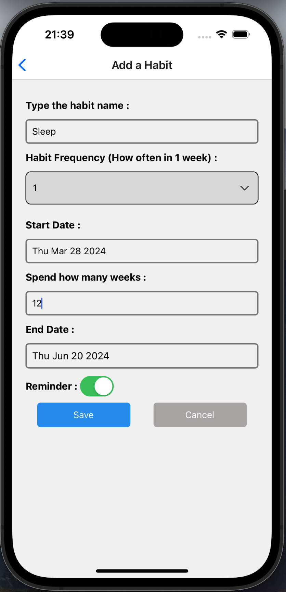
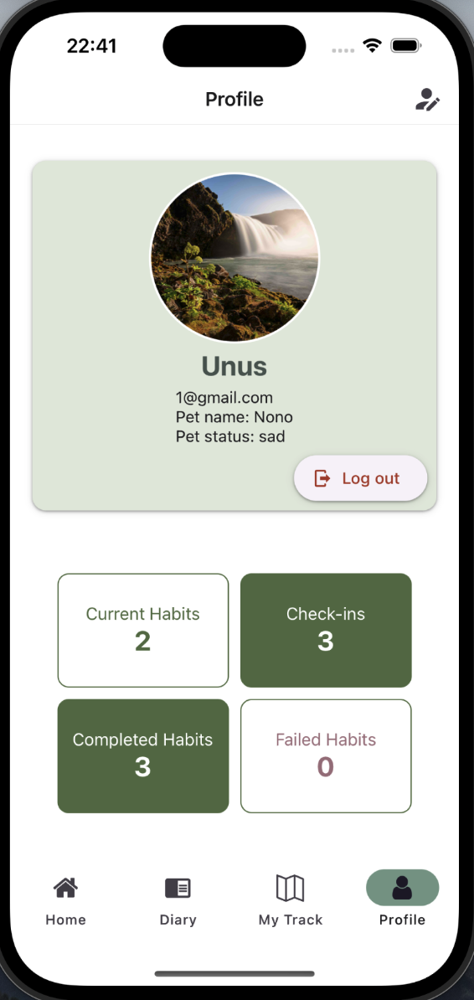

# Habit Buddy Mobile App

Habit Buddy is a mobile application designed to help users track and maintain their habits. It allows users to create, monitor, and reflect on their daily habits and routines.

## Data Model

Our application utilizes Firestore as a NoSQL database and includes the following collections:

1. **Users**: Stores user profiles, including authentication data, preferences, and related habits.
2. **Habits**: Contains details of the habits tracked by users, such as habit name, frequency, and progress.
3. **CheckIns**: Used for tracking daily check-ins for habits, storing dates, whether the habit was completed and users' diary entries, allowing them to reflect on their daily activities and habit progress.

### Firebase Rule

```
rules_version = '2';
service cloud.firestore {
  match /databases/{database}/documents {

    // Allow only authenticated users to read/write/delete their own documents
    match /{document=**} {
      allow read, write, create: if request.auth != null;
    }
    match /user {
    	allow read, update, delete: if request.auth != null && request.auth.uid == resource.data.user;
    }
    match /{document=**} {
      allow read;
    }
  }
}
```

### Firebase indexes

#### If you encounter the following error, please manually add the indexes in Firebase. Copy the link in the error message, paste it to the browser and follow the instructions to add indexes, wait for a few minutes then the error should be fixed.


## Team Members and Contributions

1. Jiaomei Zhou (Jamie): Home, Profile, Habit detail, Authentication, Camera use, API use.
2. Weiyi Gao: Add habit, Edit habit, Post diary, All diaries, Diary detail, Location use, Notification.

## Development log

### Jamie

#### Completed

##### Iteration 1 (03/22/2024 - 03/28/2024)

1. Firebase setup
2. Signup/Login/logout
3. Home screen v1 and v2: habit list, progress bar, checkin box, pet
4. Profile screen: display user profile and user stats, allow edit profile.
5. Navigation: Bottom tabs, allow navigate from signup/login to home
6. Database: Listen to real time checkins, habits and user profile data from DB. Write checkin data and delete checkin to db by toggle checkin box.

##### Iteration 2 (04/01/2024 - 04/11/2024)

1. Finish UI for Home, Profile, Login/signin, Habit detail screen.
2. Finish Authentication.
3. Implement the main logic of pet status.
4. Finish camera use and allow upload an image from gallery.
5. Fix many bugs.

##### Iteration 3 (04/13/2024 - 04/20/2024)

1. API use: fetch a random dog fact from Dog API (https://dogapi.dog/), display the fact text when the user pet the pet in the Home screen.
2. Display all my diaries in Diary screen.
3. UI design: pet, post diary, profile, etc.
4. Documantation and bug fix.

### Weiyi

#### Completed

##### Iteration 1 (03/24/2024 - 03/28/2024)

1. Add addHabitScreen and editHabitScreen.
2. Create CRUD operations of habit related logic.
3. Add helpers file to convert time format.
4. Create custom component (IconButton, PressableButton, CustomTextInput, CustomText, CustomSwitch, CustomDropDownPicker, CustomDateTimePicker,CustomCheckBox)
5. Update addHabitScreen to use the custom components.
6. Add postDiary screen.
8. Add diary screen.
9. Add diaryDetail screen. 
10. Update addHabit and editHabit screen to use the data from the database.
11. Fix conflict code and bugs.

##### Iteration 2 (04/07/2024 - 04/11/2024)

1. Update DiaryDetail component to fix Image missing bug.
2. Update PostDiary componenet to use the Imagemanager component and upload and fetch Img link from firebase storage.
3. Add Map component to locate user location or let user choose location from the map.
4. Add LocationManager component to handle the location functionality.
5. Add TrackMap component to show multiple check in locations of a user.
6. Update LocationManager component to fix bug and improve UI layout
7. Update Diary component to add a add button to let user to add a check in record easily.
8. Update PostDiary component to add a function of link a habit to a check in record.
9. Update Diary and PostDiary componenets' UI display.

##### Iteration 3 (04/18/2024 - 04/20/2024)
1. Add local notification and search and finish the UI of datetime picker component on IOS and Andriod platforms.
2. Optimize UI display for Diary, DiaryDetail.
3. Add documantations and fix code conflicts and bugs.
## App Progress and Screenshots

### Iteration 1:

During the 1st iteration of our project, we focused on laying the groundwork for the Habit Buddy Mobile App, including the initial setup of our development environment, establishing the app's overall structure, and beginning the implementation of core functionalities.

1. **React Native Components**: Created foundational components to represent the main functionalities we plan to build. This includes components for user habits, diaries, and the navigation structure.

2. **Navigation**: Implemented the basic navigation structure using React Navigation. This includes navigation between screens such as Home, Diary, Add Habit, and Profile.

3. **CRUD Operations**: Established the basis for CRUD operations with Firestore. This allows for the creation, reading, updating, and deletion of data across our app's features.

4. **Data Model Design**:

   - **Users**: Handles basic user data, including user profiles. Users can update their names and other profile details.
   - **Habits**: Allows users to create, edit, and delete custom habits. The Home screen fetches and displays all habits associated with the user.
   - **CheckIns**: Enables users to add daily check-in records related to each habit, including mood logs and completion status. The Diary screen showcases all public check-in records from users.

5. **CRUD Operations Detail**:
   - **Users Collection**: Implemented read and update operations for user profiles.
   - **Habits Collection**: Fully implemented CRUD operations, enabling users to manage their habits directly from the app.
   - **CheckIns Collection**: Implemented create update and read operations, allowing users to log daily activities and view them in a diary format.

### Iteration 2:

During the 2nd iteration of our project, we focused on enhancing the app by integrating some functionalities such as authentication, camera usage, location services, UI optimizations, and bug fixes. This iteration aimed at enriching the user experience and laying a robust foundation for future features.

1. **Authentication**:
   Improved a secure login and signup functionality using Firebase Authentication.
   Implemented password reset functionality to aid users who forget their login credentials.
2. **Camera Use**:
   Integrated camera functionality to allow users to add pictures to their diary entries directly from their device's camera.
   Users can also upload images from their gallery to personalize their diary entries further.
3. **Location Use**:
   Integrated geolocation services to enable users to add location data to their habits and diary entries.
   This feature allows the app to automatically capture the user's current location during a check-in or allow users to manually select a location on a map.
4. **UI Enhancements**:
   Overhauled the user interface to make it more visually appealing and user-friendly.
   Improved the navigation flow within the app, making it easier for users to switch between different features and screens.
5. **Bug Fixes**:
   Addressed various bugs reported in the first iteration, including issues with data synchronization, UI glitches, and performance bottlenecks.

### Iteration 3

During the 3rd iteration of our project, we concentrated on enhancing notification features, integrating external API data, and further refining the app's UI/UX design. This iteration aimed at providing users with more contextual information and a smoother overall experience.

1. **Local Notification**:
   Implemented a Notification Manager component to handle local notification. In the Profile screen, user can set a daily remainder which sends a local notification to themselves and remind the user to check in everyday.

2. **API Integration**:
   Integrated the Dog API (https://dogapi.dog/) to fetch random dog facts. Displayed these facts when users interacted with the pet feature on the Home screen, adding an element of fun and engagement to the app.

3. **UI/UX Optimization**:
   Continued to refine and optimize the user interface across various screens such as Home, Profile, Post Diary, etc. Improved the pet interaction feature's visual appeal and responsiveness, enhancing user engagement. For Diary and Post Diary screens, updated UI display and functionality, making it easier for users to manage and view their diary entries.

4. **Bug Fixes**:
   Fix any remaining bugs, including issues about location use.

### Current State of the Application and Future Improvements:

#### Current State of the Application:

We have finished all 3 iterations. Now all the essential features have been finished, like habit tracking, user authentication, diary entries, location services, API integration for fun dog facts, and a user friendly UI.

#### Future Improvements:

1. **Social Features**: Introduce social elements such as habit sharing, community building, and peer support to foster motivation and accountability among users.

2. **Gamification**: Gamify the habit tracking process with challenges, rewards, and leaderboards to make habit formation more engaging and rewarding.

3. **Advanced Notifications**: Implement intelligent notifications based on user habits and preferences to provide reminders, motivational messages, and personalized recommendations.

4. **Accessibility and Localization**: Ensure accessibility features and support for multiple languages and cultural preferences to make the app inclusive and accessible to a wider audience.

### Iteration 1:

_The Home welcome screen displaying default habits that users can adopt into their daily routine._


_The Home screen showcasing a list of user habits._


_The Habit Detail Screen providing detailed information about a specific user habit._


_The Add Habit Screen allows users to create new habits, customizing details such as habit name, frequency, and reminders._



_The Post Diary Screen enables users to record their daily activities and reflections related to their habits._


_The Diary List Screen displays a comprehensive list of diary entries._


_The Profile Screen provides users with an overview of their personal information and settings, allowing for customization and updates to their account details._


### Iteration 2:

_The Home welcome screen displaying default habits that users can adopt into their daily routine._


_The Home screen showcasing a list of user habits._


_The Post Diary Screen enables users to record their daily activities and reflections related to their habits._


_The Diary List Screen displays a comprehensive list of diary entries._


_The Diary Detail Screen displays a detailed information of a diary entries._


_The My Track Screen displays the user's all shared locations with their diary content._


_The Profile Screen provides users with an overview of their personal information and settings, allowing for customization and updates to their account details._



_The Edit Profile Screen lets users to update to their account details._


### Iteration 3:


